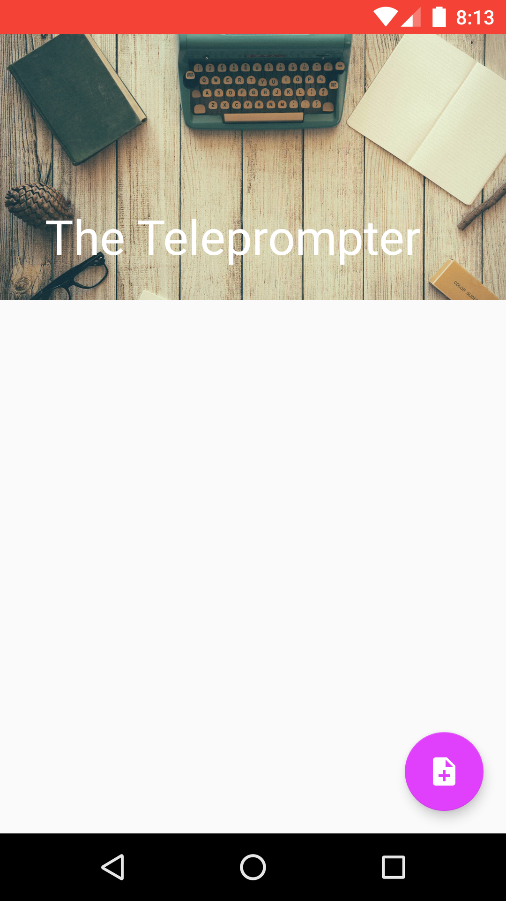
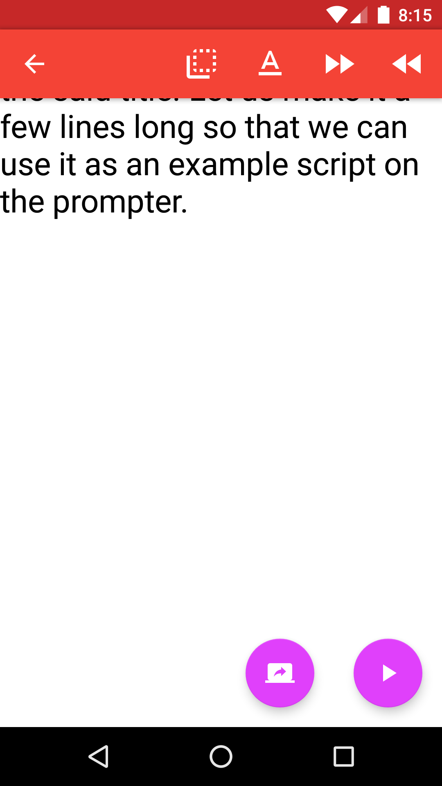
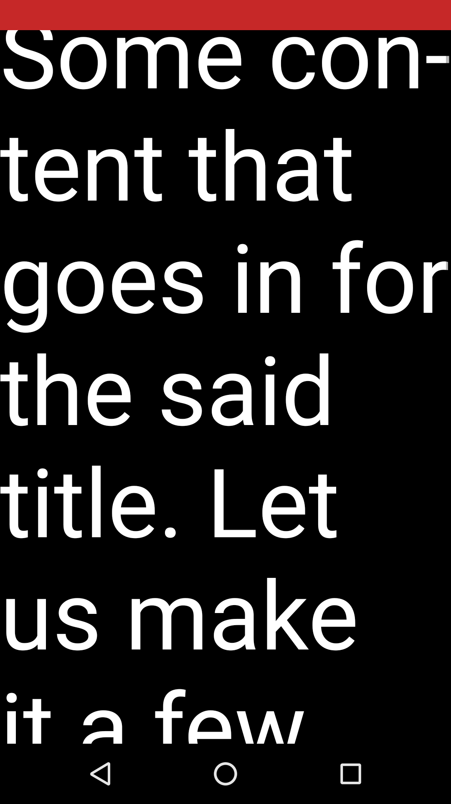

#The Teleprompter
###Description 

A teleprompter app that will let users type up or copy and paste any script or song lyrics and use it as a teleprompter. The text will scroll based on the settings that the user chooses. The script can be saved for retrieval later on as well.

###Intended User
The following are the intended users for this app:
- Public speakers
- News readers
- Video casters
- Karaoke singers

###Features
Here are the main features of the APP:
- Displays scripts.
- Very customizable in terms of the font size, line spacing and scroll speed.
- Changeable background and foreground colors.
- Scripts are able to be saved for future use.
- Can share the scripts with others.

###User Interface Mocks
These can be created by hand (take a photo of your drawings and insert them in this flow), or using a program like Photoshop or Balsamiq. 
####Screen 1: Main Activity
This is the entry point of the application. It will have a listview of all the saved scripts retrieved from the content provider.

####Screen 2: Settings Activity
This is the settings screen that will set up the prompter display properties

####Screen 3: New Script Activity
This will be the activity that lets the user load the script by typing or copying and pasting the info in.

####Screen 4: Prompter Activity
This is where the script will be displayed based on the settings set up by the user.

###Key Considerations
####How will your app handle data persistence? 
App will connect to a content provider that will use file io for data persistence. The data model here consists of:
- title:String
- content:String
Each file will be .txt file making it easy to share via attachment as well.

###Describe any corner cases in the UX.
There will be three activities:
- Entry point - List Activity that shows a list of all the persisted scripts with.
- New Script - Activity that lets the user copy and paste or type a new script.
- Prompter - Fullscreen Activity that will just display the script based on the settings.
-  Settings - Set different settings options like font size, scroll speed, colors etc.

###Describe any libraries you’ll be using and share your reasoning for including them.
Will be using Glide to load the profile image since implementing google play services and will be loading the G+ profile pic through Picasso.

###Next Steps: Required Tasks
This is the section where you can take the main features of your app (declared above) and decompose them into tangible technical tasks that you can complete incrementally until you have a finished app.
####Task 1: Project Setup
For the project setup, the following need to be implemented:
- Gradle dependencies for admob
- Gradle dependencies for google plus
- Gradle dependencies for Picasso

####Task 2: Ready the content provider
The content provider needs to be able to:
- Load all the scripts found in the application directory, documents directory and downloads directory.
- Save a new script with the format [title].[txt] with the content inside the file.

####Task 3: Ready the Prompter UI
The prompter UI will show the script based with the following things in mind:
- Load the script found in the intent
- Set the display based on the UI settings (font size, scroll speed, color etc.)

####Task 4: Ready the Settings Activity
Settings activity will let the user customize the following:
- Prompter font size
- Prompter font color
- Prompter scroll speed
- Prompter Background color

####Task 5: Ready the New script Activity
The new script activity will load the Script to the Prompter 

#### Screenshots:

